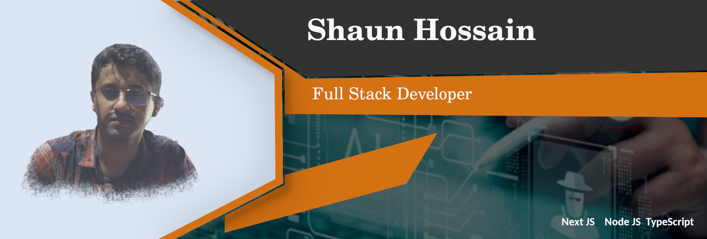
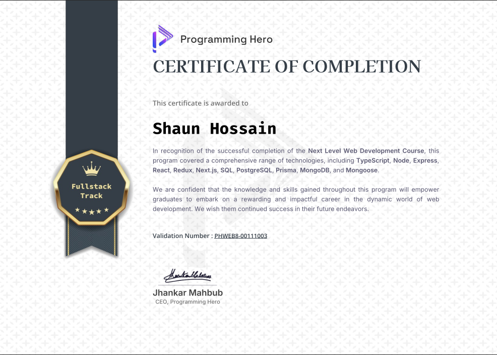

# Hi there, I'm Shaun Hossain 👋 
### Senior Full-Stack Engineer | Security-Conscious Software Builder

Direct, high-impact technical professional with 3+ years of experience engineering scalable enterprise web ecosystems, robust ERP platforms, and secure APIs. Specialized in the JavaScript/TypeScript ecosystem with an architectural focus on performance, system optimization, and application security guardrails.

---

### 🛠️ Core Technology Stack

| Focus | Technologies |
| :--- | :--- |
| **Frontend Architecture** | `Next.js (App Router)` `React.js` `Vue.js` `Redux Toolkit` `Tailwind CSS` |
| **Backend & APIs** | `Node.js` `Express.js` `RESTful APIs` `Prisma ORM` |
| **Data & Storage** | `PostgreSQL` `MongoDB` `Redis` |
| **Engineering Foundations** | `Data Structures & Algorithms (DSA)` `OOP` `SOLID Principles` `Design Patterns` |
| **Infrastructure & Security** | `Docker` `AWS (EC2/S3)` `GitHub Actions (CI/CD)` `AppSec (OWASP Top 10)` |

---

### 🚀 What I'm Focused On Right Now

*   **System Scale & Optimization:** Advanced database transaction design, query tuning in PostgreSQL, and high-performance serverless caching.
*   **Application Security (AppSec):** Deepening expertise in secure code review, input validation/sanitization, threat modeling, and integrating automated dependency/vulnerability scanners (`SAST`/`SCA`) into software delivery pipelines.
*   **Algorithmic Mastery:** Actively solving complex computational challenges to maintain sharp problem-solving workflows.

---

### 🏆 Professional Landmarks

*   **Enterprise Impact:** Spearheaded frontend architecture modules for large-scale enterprise ERP systems, supporting hundreds of concurrent daily internal users and boosting rendering performance significantly.
*   **Performance Engineering:** Systematically reduced enterprise app load times by **35%** through structural code-splitting, aggressive memoization patterns, and API payload optimizations.

---
---
###  My Github Stats:

<!--START_SECTION:waka-->

<!--END_SECTION:waka-->

⏳ **Year Progress** { ████████████▁▁▁▁▁▁▁▁▁▁▁▁▁▁▁▁▁▁ } 42.74 % as on ⏰ 28-May-2025

---

###  Awards and Achievement:

