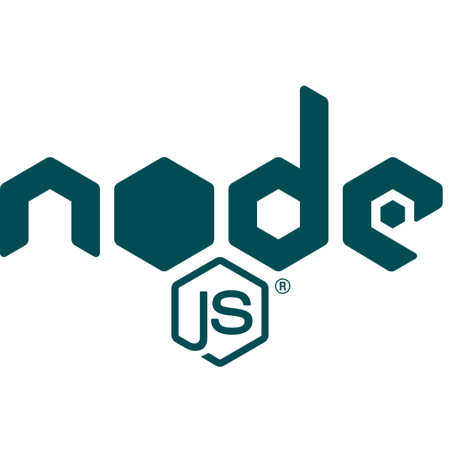
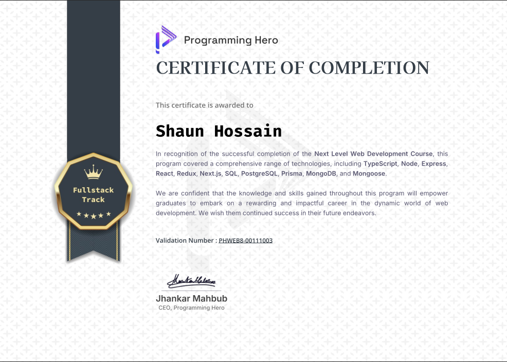

## As Salamu Alaikum, I am [Shaun Hossain](https://my-portfolio-client-kappa.vercel.app/)

 

###  About Me:
- 🏦 I'm a Full Stack Web Developer currently for a software company in Bangladesh
      

- 💻 I daily work on: **Vue.js**, **React.js**, **Node.js**,  **MongoDB**
- 📖 I am currently learning Data Structure and Algorithm through a course.
- 💬 You can share your ideas to transform them in a digital platform/Website

- 🧑‍💻 Tech I work on :

       
       
       
       
       
       
       
       
       
       
       
       
       

---
###  My Github Stats:

<!--START_SECTION:waka-->

<!--END_SECTION:waka-->

⏳ **Year Progress** { ████████████▁▁▁▁▁▁▁▁▁▁▁▁▁▁▁▁▁▁ } 42.74 % as on ⏰ 28-May-2025

---

###  Awards and Achievement:

